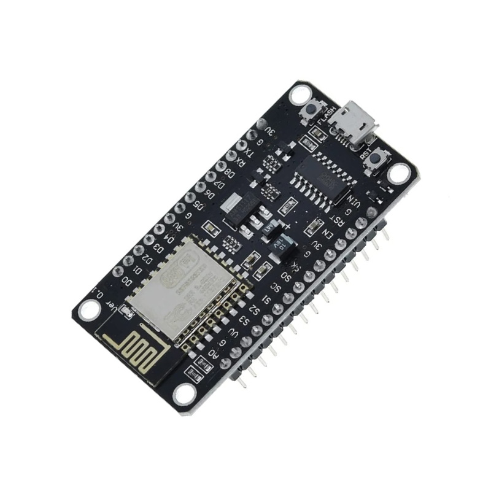
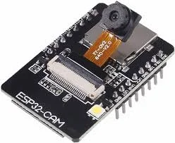
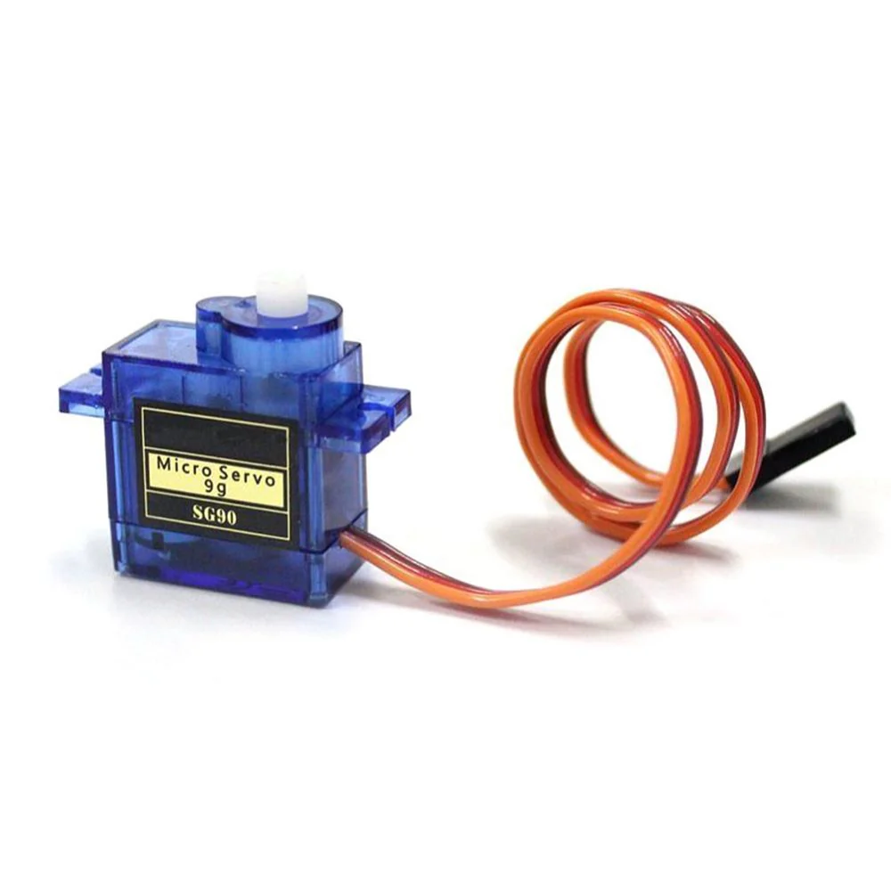
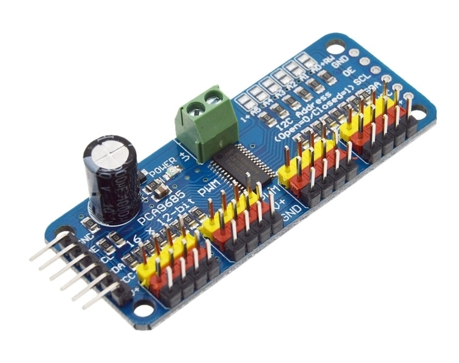
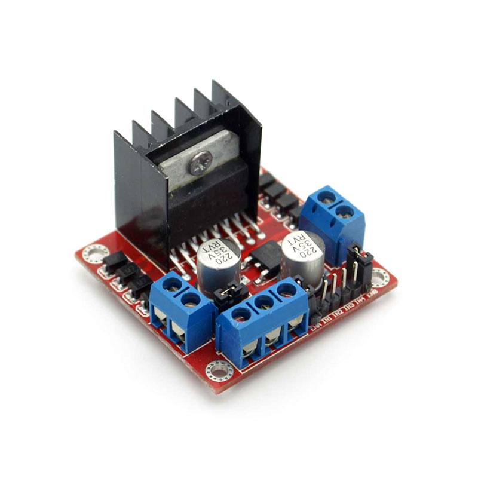

This repository contains the code and resources for developing Braille Bot aimed at assisting visually impaired individuals to read through Braille Script in real time. The project leverages computer vision and AI to make the world more accessible.
## Table Of Content
- [Project Overview](#project-overview)
- [Features](#features)
- [Installation](#installation)
- [Hardware Required](#hardware-required)
- [License](#license)
## Project Overview
A robotic bot that captures text, processes images, and converts to Braille using machine learning algorithms. The bot then simulates the dots, providing tactile feedback for visually impaired individuals, enabling independent reading experience.
## Features

- Image Capturing: Captures images containing some textual information
- Text Recognition (OCR): Detects and reads printed or handwritten text.
- Image Captioning: Generates descriptive text for an image using computer vision techniques.
- Braille Conversion: Translates recognized text into Braille using a predefined dataset.
- Reading: Simulates tactile Braille dots based on the converted script to facilitate reading.


## Installation

1. Clone the Repository

```bash
git clone https://github.com/a-ksharma/Braille-Bot
cd Braille-Bot
```

2. Upload Code to Arduino

- Open Arduino_Code/sketch_apr10a.ino in Arduino IDE.
- Select board: NodeMCU
- Upload the sketch.

3. Connecting Camera Web Server
- Open Camera-Web-Server/CameraWebServer.ino in Arduino IDE.
- Select board: AI-Thinker ESP32-CAM
- Upload the sketch and connect it with the python script and esp8266.

4. Run Braille Converter

```bash
cd Braille_Converter
python main.py
```
## Hardware Required
- Processing Unit: ESP8266

- Camera Module: ESP32-Cam
  

- Braille Generation: 6 SG90 Servo Motors

- Servo Motor Driver: Adafruit PCA9685 16-Channel Servo Driver

- Power Suply: AC to Dc Adapter(12V - 1A) and L298N Motor Driver

## License
This project is licensed under the [MIT](https://choosealicense.com/licenses/mit/) License. See the LICENSE file for details.
